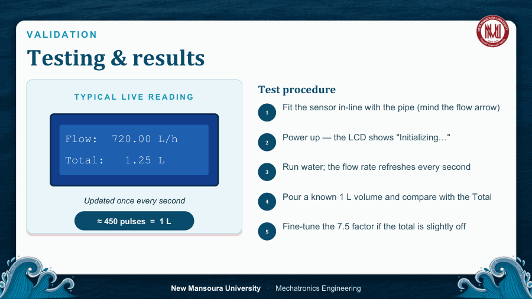
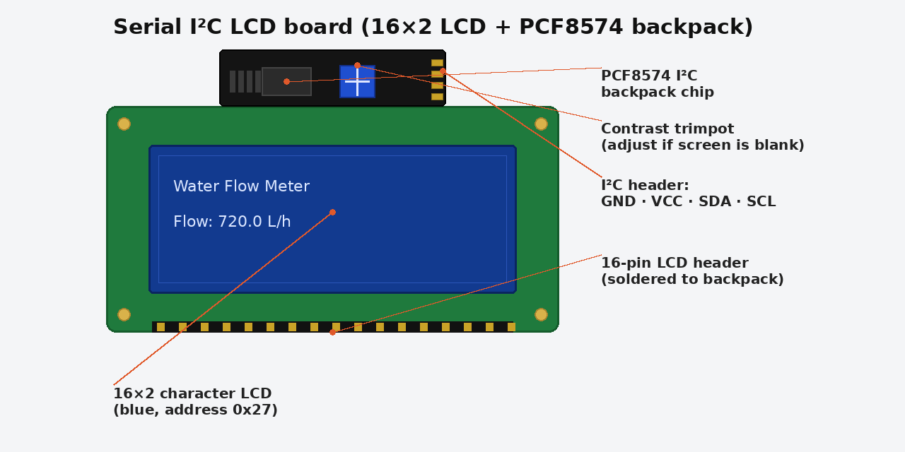

# Water Flow Meter


**Arduino-based real-time flow-rate & volume measurement** using a **YF-S201**
Hall-effect sensor and a 16×2 I²C LCD.


> Course project — New Mansoura University, Faculty of Engineering, Mechatronics
> Engineering. Presented by **Marrwan**, supervised by
> **Prof. Mohamed M. Tawfik** and **Eng. Yosef Gabr**. Academic year 2025/2026.

---

## Overview

A water flow meter measures how fast water moves through a pipe and how much
has passed in total. The YF-S201 sensor turns flow into a train of electrical
pulses; the Arduino counts those pulses with a hardware interrupt, converts the
count into a flow rate and an accumulated volume, and shows both live on the LCD.

**Objectives**
- Measure real-time flow rate (L/h) and total volume (L)
- Read the sensor with a hardware interrupt — no missed pulses
- Display results on a 16×2 I²C LCD
- Calibrate against a known volume to keep readings accurate

---

## Components (Bill of Materials)

| Part | Details |
|------|---------|
| **Arduino Uno** | ATmega328P — counts pulses & drives the LCD |
| **YF-S201 flow sensor** | Hall-effect turbine, 1–30 L/min, pulse output |
| **I²C LCD 16×2** | PCF8574 backpack, address `0x27` |
| **Power** | Laptop USB → steady 5 V |
| Misc | Jumper wires · ½″ pipe fittings · USB cable |

### YF-S201 key specs
| Spec | Value |
|------|-------|
| Operating voltage | 5–24 V |
| Current @ 5 V | ≤ 15 mA |
| Flow range | 1–30 L/min |
| Pulses per litre | ≈ 450 |
| Pulse characteristic | `f = 7.5 × Q` (Q in L/min) |
| Accuracy | ±3 % (tighter after calibration) |
| Max pressure | ≤ 1.75 MPa |

---

## Wiring


| Wire / signal | Arduino pin | Function |
|---------------|-------------|----------|
| Sensor +5V (red) | 5V | Power |
| Sensor signal (yellow) | **D2 (INT0)** | Pulse input — interrupt |
| Sensor GND (black) | GND | Ground |
| LCD VCC | 5V | Power |
| LCD GND | GND | Ground |
| LCD SDA | A4 | I²C data |
| LCD SCL | A5 | I²C clock |

> D2 is the INT0 interrupt pin; A4/A5 are the I²C lines on the Uno. The board is
> USB-powered (5 V from the laptop). Add a **10 kΩ pull-up** from the signal wire
> to 5 V to suppress noise, and make sure the arrow on the sensor points in the
> direction of water flow.

---

## Governing equations

| # | Law | Formula |
|---|-----|---------|
| 1 | Sensor pulse law | `f = 7.5 × Q`   (Q in L/min) |
| 2 | Flow rate | `Q(L/h) = f × 60 / 7.5 = 8f` |
| 3 | Accumulated volume | `V = Σ pulses / (K × 60)` , K = pulses/L |
| 4 | Calibration constant | `≈ 450 pulses = 1 litre` (7.5 × 60) |

**Worked example:** if `f = 90 Hz` → `Q = 90/7.5 = 12 L/min` → `720 L/h`, and the
volume added in one second is `720/3600 = 0.20 L`.

---

## The code

Sketch: [`Water_Flow_Project/Water_Flow_Project.ino`](Water_Flow_Project/Water_Flow_Project.ino)

Highlights (this version improves on the basic tutorial sketch):
- **Interrupt-safe pulse counting** — the count is snapshotted and reset inside
  `noInterrupts()/interrupts()`, so no pulse is lost or double-counted.
- **Noise/debounce filter** — pulses arriving faster than physically possible
  (`< 1 ms` apart) are rejected, which fixes falsely high readings.
- **Exact volume** — volume is summed straight from the pulse count
  (`pulses / (K × 60)`), independent of loop timing.
- **Flicker-free LCD** — rows are overwritten with padding instead of clearing.
- **Serial calibration mode** — send `c` to measure your sensor's real K-factor.

### Libraries required
Install via Arduino IDE → *Tools → Manage Libraries*:
- **LiquidCrystal_I2C**
- **Wire** (built in)

### Usage
1. Open `Water_Flow_Project/Water_Flow_Project.ino` in the Arduino IDE.
2. Upload to the Uno.
3. Open Serial Monitor at **9600 baud**, line ending = **Newline**.
4. Normal mode shows flow rate + total volume on the LCD and over Serial.

---

## Calibration (volumetric method)

> ⚠️ **Every YF-S201 is slightly different — do your own calibration.**
> The built-in `7.5` factor is only a nominal, datasheet value. Cheap sensors can
> be off by a lot, which is why readings may look too high or too low out of the
> box. **Don't trust the default — run the calibration below once for your own
> sensor and plumbing**, then update `CALIBRATION_FACTOR` with the value it gives
> you. It takes two minutes and makes your numbers actually accurate.

The nominal factor `7.5` (≈450 pulses/L) has a ±3 % tolerance, so calibrate to
your exact sensor and plumbing:

1. In the Serial Monitor, type `c` + Enter to start a **30-second** window.
2. Collect the water into a measuring container for the full window.
3. Enter the actual volume collected (in litres) and press Enter.
4. The sketch prints your measured **K-factor** — replace `CALIBRATION_FACTOR`
   at the top of the sketch with it and re-upload.
5. Repeat at a slow and a fast flow rate and average the two values.

Formula used: `K = pulses counted / volume (L)`.

---

## Results



A typical live reading updates once per second, e.g. `Flow: 720.00 L/h` /
`Total: 1.25 L`.

---

## Build & assembly notes




*The Serial I²C LCD board: the PCF8574 backpack soldered onto the 16×2 LCD,
showing the GND / VCC / SDA / SCL header and the blue contrast trimpot.*

**Assembling the Serial I²C LCD board.** The display came as a bare 16×2
character LCD. A **PCF8574 "I²C backpack"** (the serial adapter board) was
**soldered onto the LCD's 16-pin header** — this converts the LCD's 16 parallel
pins into a simple 4-wire I²C bus (VCC, GND, SDA, SCL) and frees up Arduino pins.
Points that mattered during assembly:
- All 16 header pins had to be soldered cleanly — a bridged or cold joint on
  adjacent pins stops the display from initialising, so every joint was checked
  for bridges afterwards.
- The backpack's I²C address is **`0x27`** (some modules are `0x3F`). It's set in
  the sketch: `#define LCD_I2C_ADDRESS 0x27`.
- The small blue **trimmer potentiometer** on the backpack sets contrast — if the
  screen shows only bright boxes or nothing at all, that pot is turned until the
  text is crisp.

**Wiring the sensor module.** The YF-S201 has three leads — red `+5V`, black
`GND`, yellow `signal`. The yellow signal wire goes to **D2 (INT0)** so each pulse
fires a hardware interrupt. The joints/connectors on the sensor leads were
reinforced so handling and vibration don't break the pulse line, and the arrow on
the sensor body points in the direction of water flow.

**Power.** Everything runs from the laptop **USB (regulated 5 V)**, which also
feeds the LCD backpack and the sensor.

## Challenges I faced

| # | Problem | Cause | Fix |
|---|---------|-------|-----|
| 1 | **Flow rate read far too high** | Electrical noise on the signal line was counted as extra pulses, and the nominal `7.5` factor didn't match the real sensor | Added a **debounce filter** in the interrupt (ignores pulses < 1 ms apart — physically impossible for this sensor) and a built-in **calibration routine** to measure the true factor |
| 2 | **Pulses lost / double-counted** | The pulse counter was read and reset outside an interrupt-safe block, so an interrupt could fire mid-update | Snapshot + reset the counter inside `noInterrupts()/interrupts()` |
| 3 | **LCD flicker every second** | The whole screen was cleared with `lcd.clear()` on every refresh | Overwrite each row with padded text instead of clearing |
| 4 | **LCD showed blank boxes / nothing** | Wrong I²C address and unset contrast | Used address `0x27` and adjusted the contrast trimpot on the backpack |
| 5 | **Soldering the 16-pin I²C backpack** | Cold / bridged joints on the dense header stopped the display initialising | Re-flowed the joints and checked each pin for bridges |

## Applications
Water billing · irrigation · leak monitoring · industrial dosing · beverage
machines · smart-home water tracking.

## Future work
- Calibrate against a reference meter for higher accuracy
- ESP32 + Wi-Fi for IoT logging & dashboards
- Save totals in EEPROM so they survive a power-off
- Flow alarms + relay for automatic shut-off
- 18650 battery pack for untethered field use

---

## Repository structure
```
water_flow_metar/
├── README.md
├── LICENSE
├── Water_Flow_Project/
│   └── Water_Flow_Project.ino     # the Arduino sketch
├── docs/
│   └── Water_Flow_Meter_Presentation.pdf
└── images/
    ├── cover.png
    ├── wiring.png
    ├── results.png
    └── i2c_lcd_board.png
```

## Documentation
Full presentation: [`docs/Water_Flow_Meter_Presentation.pdf`](docs/Water_Flow_Meter_Presentation.pdf)

## References
1. YF-S201 Water Flow Sensor — datasheet, Foshan Shunde Zhongjiang Energy-Saving Electronics Co., Ltd.
2. Arduino® Uno R3 pinout (A000066) — docs.arduino.cc, CC BY-SA 4.0.
3. Arduino libraries: LiquidCrystal_I2C and Wire (I²C).
4. Hall effect — classical semiconductor physics (E. H. Hall, 1879).

## License
Released under the [MIT License](LICENSE) — free to use, modify, and share.
